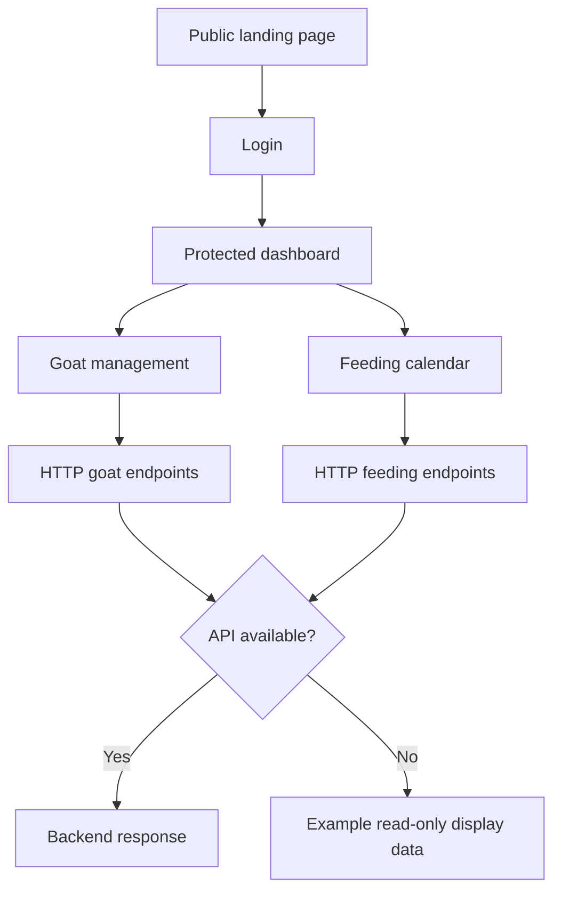

# KarangnongkoFarm

**Goat farm management frontend for barn inventory and feeding records.**

KarangnongkoFarm is a web-based prototype for organizing livestock records in **Karangnongko, Klaten, Central Java, Indonesia**. Developed in the context of a community-oriented/KKN digitalization project, it explores how farm administrators and barn handlers could manage goat information and daily feeding activities through one responsive interface.

The application combines a public landing page with a sign-in screen and an internal workspace covering **dashboard statistics, goat records, and a feeding calendar**.

> **Implementation status — frontend prototype / demo-enabled.** This repository contains the React application and an HTTP API client, **not a working backend or database**. Some screens fall back to example records when API requests fail. Creating, editing, and deleting real records requires a compatible backend. Do not treat the example statistics as actual farm measurements.

## The problem

Small livestock operations can rely on handwritten notes or fragmented spreadsheets to answer basic operational questions:

- Which goats are assigned to each barn?
- What is each animal's tag, age, weight, and reported health status?
- When was feeding recorded, and which barn was involved?
- How can administrators and handlers review the same records without switching between separate files?

KarangnongkoFarm is a frontend exploration of a more structured workflow: **animal records + barn-level organization + dated feeding logs**.

## Features and implementation status

| Module | What the interface provides | Current behavior |
| --- | --- | --- |
| Public landing page | Project introduction, feature overview, and sign-in entry point | Static content; displayed statistics and testimonials are examples |
| Sign-in | Login form and authenticated-route navigation | Contains hardcoded demo accounts; can also attempt API login |
| Dashboard | Total animals and distribution across West/East barns; quick navigation | Fetches `/goats/stats`, with hardcoded fallback statistics |
| Goat management | List, barn filter, add/edit/delete dialogs, tag, age, weight, gender, and health status | Reads from `/goats`; falls back to three sample goats on failure; writes require an API |
| Feeding schedule | Monthly calendar, date-based logs, add/edit/delete dialogs, barn and feeding-time details | Uses `/feed-logs`; displays sample logs if the API cannot be reached; writes require an API |
| Barn-aware UI | Admin versus West/East barn controls for managing records | Client-side UI restrictions only; **not a substitute for backend authorization** |
| Responsive navigation | Desktop sidebar and mobile navigation | Implemented in the React application |

### Intended users

- **Administrator:** overview across barns and access to inventory and feeding screens.
- **Kandang Barat handler:** intended to work with records for the western barn.
- **Kandang Timur handler:** intended to work with records for the eastern barn.

The current demo identity model is not production-ready: demo users and the TypeScript role definitions are not completely consistent. Any real deployment must validate identity and barn permissions **on the server**.

## Application flow



A successful demo login permits navigation to protected routes, but **does not establish a secure backend session**. The application stores login state in browser `localStorage`. The backend API is expected to provide any real persistence and access control.

### Available routes

| Path | Screen | Access |
| --- | --- | --- |
| `/` | Landing page | Public |
| `/login` | Sign-in | Public |
| `/dashboard` | Farm overview | Client-side protected |
| `/goats` | Goat inventory and forms | Client-side protected |
| `/feeding` | Feeding calendar and forms | Client-side protected |
| Other paths | Not-found page | Public |

## Tech stack

| Concern | Technologies |
| --- | --- |
| Frontend | React 18, TypeScript |
| Build | Vite 5, SWC |
| Navigation | React Router DOM 6 |
| Styling | Tailwind CSS 3, shadcn/ui-style components, Radix UI, Lucide icons |
| HTTP integration | Axios |
| Data and UI utilities | TanStack React Query, date-fns, Sonner |
| Prototype tooling | Lovable integration (optional for editing) |
| Package management | npm (`package-lock.json`); a Bun lockfile also exists |

**Architecture at a glance**

```text
Browser
  |
  +-- React pages and components
  |     +-- Public landing + login
  |     +-- AuthContext / ProtectedRoute
  |     +-- Dashboard, goats, feeding
  |
  +-- src/services/api.ts (Axios client)
        |
        +-- GET /goats/stats, /goats
        +-- GET /feed-logs
        +-- POST /login, /goats, /feed-logs
        +-- PUT and DELETE /goats/:id, /feed-logs/:id
        |
        v
    External backend API (not in this repository)
```

The configured API base URL in `src/services/api.ts` is currently a **hardcoded placeholder** (`https://api.karangnongkofarm.com/api`). The presence of that address in source code is **not evidence of a running API**.

## Data handled by the UI

**Goat:** identifier, tag number, weight (kg), age (months), gender (`male` / `female`), health status (`healthy` / `sick` / `dead`), and barn (`barat` / `timur`).

**Feeding log:** identifier, date, feeding time, barn, optional note, and associated user identifier.

The UI supports animal CRUD and feeding-log CRUD through HTTP calls; these are **integration points**, not an embedded database. When reads fail, the goats page and feeding page supply temporary local sample arrays for display. Those arrays are not persisted and should not be mistaken for synchronized farm records.

## Run locally

### Requirements

- A recent Node.js LTS installation compatible with Vite 5.
- npm.
- An optional compatible backend service if you want persistent login, goat records, or feeding logs.

```bash
git clone https://github.com/alfrzhb/karangnongko-goat-keeper.git
cd karangnongko-goat-keeper

npm install
npm run dev
```

The Vite dev server is configured for **port 8080**. Open the local URL shown in the terminal (typically `http://localhost:8080`).

To check the project:

```bash
npm run lint
npm run build
npm run preview
```

These are available package scripts. They have **not been executed as part of this README-only update**.

### Exploring demo mode

The sign-in interface includes example accounts intended for local demonstrations. See the login page for the provided demo choices; **do not reuse those credentials for a deployed application**.

With demo sign-in, you can browse the dashboard and sample records. When the backend is unavailable:

- Dashboard, goat inventory, and feeding-calendar **reads** can fall back to example values.
- **Create/update/delete actions still call the HTTP API**, so they can fail without a backend.
- Data does not become persistent simply because the screen is accessible.

### Connecting a backend

The frontend expects an external JSON API. To integrate your own service:

1. Replace the placeholder `API_URL` in [`src/services/api.ts`](src/services/api.ts) with a reachable backend URL (or refactor it to use a Vite environment variable).
2. Implement the endpoints and compatible request/response shapes listed below.
3. Configure cross-origin requests (CORS) if the frontend and API use different origins.
4. Implement secure server-side authentication and barn-level authorization.
5. Remove or disable hardcoded demo credentials and example data for a production configuration.
6. Test complete login, refresh, read, create, update, and delete flows against actual storage.

| Method | Endpoint | Purpose |
| --- | --- | --- |
| `POST` | `/login` | Authenticate a user |
| `GET` | `/goats` | List goats (optional filters) |
| `GET` | `/goats/:id` | Get a goat |
| `POST` | `/goats` | Create a goat |
| `PUT` | `/goats/:id` | Update a goat |
| `DELETE` | `/goats/:id` | Delete a goat |
| `GET` | `/goats/stats` | Retrieve count statistics |
| `GET` | `/feed-logs` | List logs (year/month filters) |
| `POST` | `/feed-logs` | Create a feeding log |
| `PUT` | `/feed-logs/:id` | Update a log |
| `DELETE` | `/feed-logs/:id` | Delete a log |

The Axios client sends a bearer token when one is stored locally and handles `401` responses by clearing local credentials. Backend contracts, database migrations, and API deployment are **outside this repo**.

## Project structure

```text
src/
├── App.tsx                  # Router, query provider, authentication context
├── routes/
│   └── AppRoutes.tsx        # Public and protected routes
├── context/
│   └── AuthContext.tsx      # Frontend authentication state
├── components/
│   ├── ProtectedRoute.tsx   # Client-side route guard
│   ├── DashboardLayout.tsx  # App shell
│   ├── Sidebar.tsx          # Desktop navigation
│   ├── MobileSidebar.tsx    # Mobile navigation
│   └── ui/                  # Shared UI primitives
├── pages/
│   ├── Landing.tsx          # Public project overview
│   ├── Login.tsx            # Sign-in and demo access
│   ├── Dashboard.tsx        # Goat-count statistics
│   ├── GoatManagement.tsx   # Goat CRUD interface
│   └── FeedingSchedule.tsx  # Feeding log calendar
├── services/
│   └── api.ts               # Backend adapter and demo fallback logic
└── types/
    └── index.ts             # UI domain models
```

## Limitations and next steps

This README describes what is actually present in the codebase, not a verified production deployment.

- **No backend or migrations here.** The repository contains only the frontend and an Axios integration layer.
- **Demo authentication is insecure.** Built-in example credentials and client-managed browser state must not be used as real access control.
- **Role handling needs reconciliation.** The demo's staff-role values and UI barn-role assumptions are inconsistent; backend authorization remains unimplemented here.
- **Data is partly illustrative.** The landing-page figures and testimonials are static content; failed reads may show sample dashboard/goat/feeding records.
- **API connectivity and production deployment are not verified.** No live deployment or persistent dataset is established by this README.
- **UI validation and error handling need hardening** before real operational use, including working integration tests and accessible form/dialog flows.

Suggested engineering priorities: **replace demo authentication**, integrate and test a real backend, enforce role permissions server-side, remove placeholder content, then conduct end-to-end testing and deploy.

## Relationship to other Karangnongko repositories

This repository is the **React/Vite frontend prototype**. The separately maintained [`sip_karangnongko`](https://github.com/alfrzhb/sip_karangnongko) repository documents a **Laravel/Filament-based livestock information system**. They should not be presented as a single integrated application without verifying an actual shared API or deployment.

## Credits and tooling

Created as part of the Karangnongko digital-farming project. The codebase uses React, open-source UI libraries, and Lovable-assisted prototype tooling.

- **Repository:** [alfrzhb/karangnongko-goat-keeper](https://github.com/alfrzhb/karangnongko-goat-keeper)
- **Lovable editor project:** [Open the original editor reference](https://lovable.dev/projects/d05e17b7-c40d-4410-ab01-23751fef593c) (editor link, **not** a verified production URL)
- **Maintainer:** [alfrzhb](https://github.com/alfrzhb)
